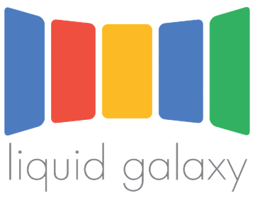
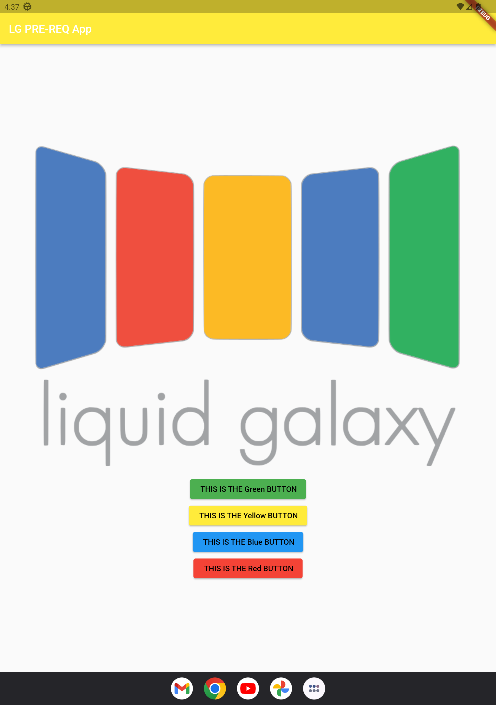

#Liquid Galaxy Pre-Req App

## About the repo

This demo application was made for completion of Liquid Galaxy Pre-Selection Req-2
So the application does basically nothing (as of now hehe), consists of the logo and 4 eye catchy buttons 😉.

Making this app was definitely a good learning experience considering me being new to the flutter framework ✏️
(Setup took some time on arch tho so linking below some valuable resources for setup and also some flutter resources).

## Some Resources...📔
https://snapcraft.io/install/flutter/arch
https://developer.android.com/studio/command-line/sdkmanager
https://docs.flutter.dev/get-started/install/linux#android-setup
https://docs.flutter.dev/get-started/flutter-for/android-devs
https://docs.flutter.dev/cookbook/images/fading-in-images
https://api.flutter.dev/flutter/material/ElevatedButton-class.html

## Application Screenshot 📱

